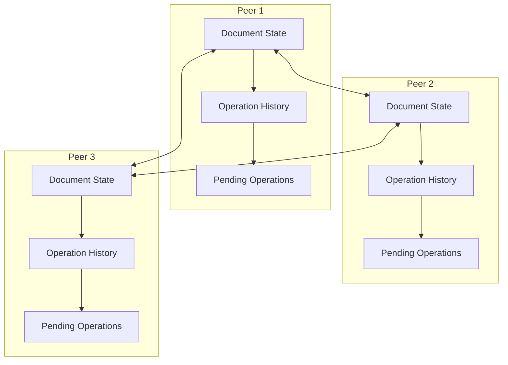
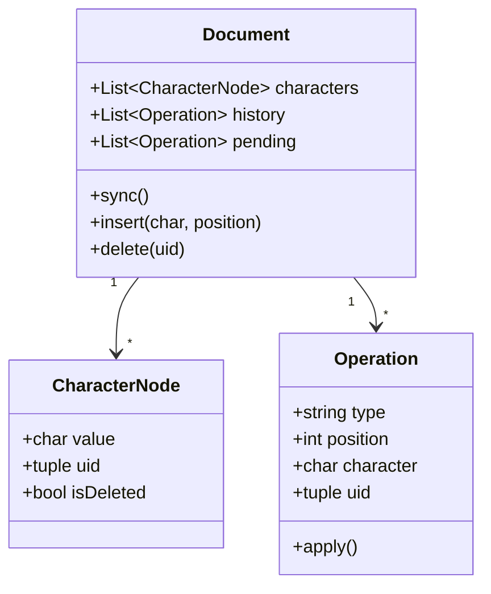
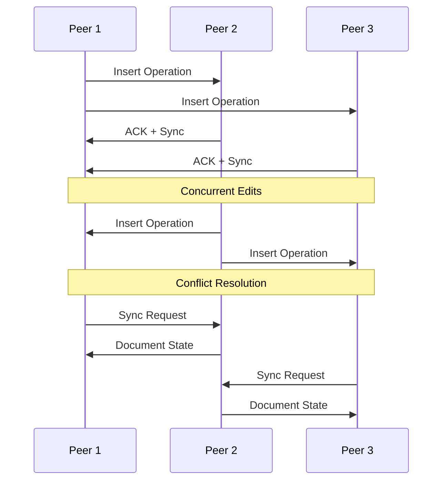
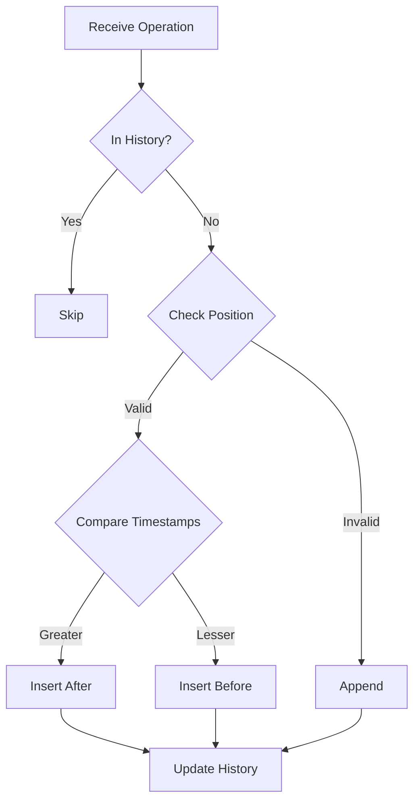

# KISE (Kotlin Independent Sync Editor)

A robust peer-to-peer collaborative text editor enabling real-time document editing across multiple users without requiring a central server. The system implements a Replicated Growing Array (RGA) data structure and provides sophisticated conflict resolution mechanisms.

## Table of Contents
- [Overview](#overview)
- [Architecture](#architecture)
- [Implementation Details](#implementation-details)
- [Network Protocol](#network-protocol)
- [Installation and Setup](#installation-and-setup)
- [Usage Guide](#usage-guide)
- [Testing Scenarios](#testing-scenarios)
- [Technical Challenges and Solutions](#technical-challenges-and-solutions)
- [Future Improvements](#future-improvements)
- [Contributing](#contributing)
- [License](#license)

## Overview

### What is KISE?
KISE is a distributed collaborative text editor that allows multiple users to simultaneously edit a document without requiring a central server. It maintains consistency across all peers through sophisticated synchronization mechanisms.

### Key Features
- Real-time collaborative editing
- Peer-to-peer architecture
- Conflict resolution using timestamps
- Network resilience (handles delays and packet loss)
- Automatic state synchronization
- Document persistence

## Architecture

### System Architecture



### Data Structure
The system uses a Replicated Growing Array (RGA) for the document structure:



### Message Flow



## Implementation Details

### Core Components

#### 1. Document State Management
```python
# Document structure
document = []  # List of (character, uid) tuples
operation_history = []  # List of all operations
pending_operations = []  # Buffer for out-of-order operations

# Thread-safe document access
document_lock = threading.Lock()
```

#### 2. Operation Handling
```python
def apply_operation(operation):
    if operation["type"] == "insert":
        position = operation["position"]
        char = operation["character"]
        uid = tuple(operation["uid"])
        
        if position < len(document):
            prev_node = document[position]
            prev_node_ts = prev_node[1][0]
            # Timestamp-based ordering
            if prev_node_ts > uid[0]:
                document.insert(position+1, (char, uid))
            else:
                document.insert(position, (char, uid))
        else:
            document.insert(position, (char, uid))
```

#### 3. Synchronization Protocol
```python
def sync_with_multiple_peers():
    documents = request_documents_from_peers()
    if documents:
        merged_document = merge_documents(documents)
        with document_lock:
            document = merged_document
            is_synced = True
```

### Network Protocol

#### Message Types
1. Document Request
```python
{
    "type": "request_document"
}
```

2. Operation Broadcast
```python
{
    "type": "insert",
    "position": int,
    "character": str,
    "uid": tuple(timestamp, peer_id)
}
```

3. Sync Response
```python
{
    "type": "document_state",
    "document": List[(char, uid)]
}
```

### Conflict Resolution



## Installation and Setup

### Prerequisites
- Python 3.6+
- Network connectivity between peers

### Installation Steps
1. Clone the repository:
```bash
git clone https://github.com/yourusername/kise.git
cd kise
```

2. No additional dependencies required

## Usage Guide

### Starting a Peer
```bash
python peer.py
Enter the host IP address: 127.0.0.1
Enter the port to listen on: 5000
```

### Available Commands
| Command | Description | Example |
|---------|-------------|----------|
| add | Add a new peer | `add` → Enter IP and PORT |
| edit | Edit document | `edit` → Choose insert/delete |
| view | Show document | `view` |
| save | Save to file | `save` |
| sync | Force sync | `sync` |
| peers | List peers | `peers` |
| exit | Close app | `exit` |

### Example Session
```bash
>> add
Enter peer IP: 127.0.0.1
Enter peer PORT: 5001
[PEER] Added peer 127.0.0.1:5001

>> edit
[EDIT] Would you like to insert or delete?
Enter 'insert' or 'delete': insert
Enter position to insert at: 0
Enter character to insert: H
[DOCUMENT] [('H', (1638245121, 'peer-5000'))]
```

## Testing Scenarios

### 1. Basic Testing (peer.py)
- Normal operation testing
- Basic synchronization
- Concurrent editing

### 2. Network Delay Testing (peerDelay.py)
```python
# Simulated delay in broadcast
delay = random.uniform(0.5, 2.0)
time.sleep(delay)
```

### 3. Packet Loss Testing (peerLost.py)
```python
# Simulated packet loss
if random.random() < loss_probability:
    print(f"[LOSS] Message to {ip}:{port} was lost")
    continue
```

### Testing Setup
To test with multiple peers:

1. Start three instances of the application:
```bash
# Terminal 1
python peer.py  # Use port 5000

# Terminal 2
python peer.py  # Use port 5001

# Terminal 3
python peer.py  # Use port 5002
```

2. Connect peers using the `add` command in each terminal:
```bash
# In Terminal 1
>> add
Enter peer IP: 127.0.0.1
Enter peer PORT: 5001

>> add
Enter peer IP: 127.0.0.1
Enter peer PORT: 5002
```

3. Test different scenarios:
   - Concurrent editing
   - Network delays using peerDelay.py
   - Message loss using peerLost.py
   - Disconnection/reconnection handling

## Technical Challenges and Solutions

### 1. Concurrent Editing
Challenge: Multiple users editing the same position simultaneously.
Solution: RGA with timestamp-based ordering ensures consistent document state.

Implementation:
```python
def merge_documents(documents):
    merged_document = []
    seen_uids = set()
    
    for doc in documents:
        for char, uid in doc:
            if uid not in seen_uids:
                merged_document.append((char, uid))
                seen_uids.add(uid)
    
    return merged_document
```

### 2. Network Issues
Challenge: Delays and packet loss affecting synchronization.
Solution: 
- Pending operations buffer
- Periodic synchronization
- Operation history tracking

### 3. Consistency
Challenge: Maintaining consistent document state across peers.
Solution:
- Eventually consistent model
- Tombstone-based deletion
- Merge operation with conflict resolution

## Future Improvements

1. Enhanced Features
   - Rich text support
   - User authentication
   - Offline editing capability

2. Performance Optimizations
   - Compressed network transfers
   - Selective sync for large documents
   - Optimized memory usage

3. User Experience
   - GUI implementation
   - Real-time cursor tracking
   - Change highlighting

## Contributing

1. Fork the repository
2. Create your feature branch
```bash
git checkout -b feature/AmazingFeature
```
3. Commit your changes
```bash
git commit -m 'Add some AmazingFeature'
```
4. Push to the branch
```bash
git push origin feature/AmazingFeature
```
5. Create a Pull Request

### Coding Standards
- Follow PEP 8 guidelines
- Add comprehensive comments
- Include unit tests
- Update documentation

## License

This project is licensed under the MIT License.

---

For questions or support, contact the contributors:
- Khairul Islam (khairul.islam@hws.edu)
- Sayf Elhawary (elhawaryseif@gmail.com)
